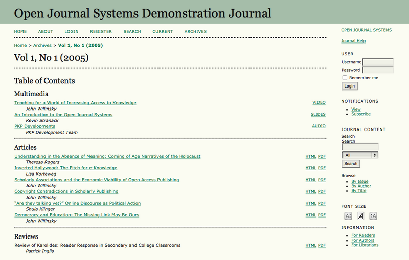
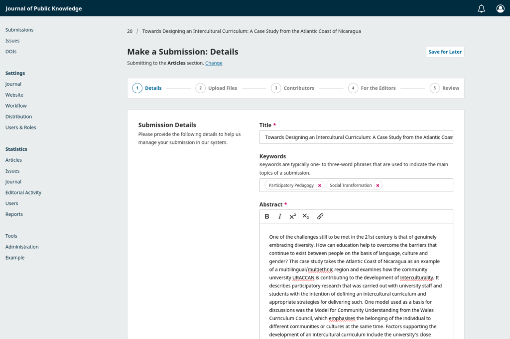

<!--
Este archivo README esta generado automaticamente<https://github.com/YunoHost/apps/tree/master/tools/readme_generator>
No se debe editar a mano.
-->

# OJS para Yunohost

[](https://ci-apps.yunohost.org/ci/apps/ojs/)


[](https://install-app.yunohost.org/?app=ojs)

*[Leer este README en otros idiomas.](./ALL_README.md)*

> *Este paquete le permite instalarOJS rapidamente y simplement en un servidor YunoHost.*  
> *Si no tiene YunoHost, visita [the guide](https://yunohost.org/install) para aprender como instalarla.*

## Descripción general

Open Journal Systems is open source software to manage scholarly journals.


**Versión actual:** 3.4.0-7~ynh4

## Capturas




## Documentaciones y recursos

- Sitio web oficial: <https://pkp.sfu.ca/software/ojs>
- Documentación usuario oficial: <https://docs.pkp.sfu.ca/>
- Documentación administrador oficial: <https://docs.pkp.sfu.ca/admin-guide/>
- Repositorio del código fuente oficial de la aplicación : <https://github.com/pkp/ojs>
- Catálogo YunoHost: <https://apps.yunohost.org/app/ojs>
- Reportar un error: <https://github.com/YunoHost-Apps/ojs_ynh/issues>

## Información para desarrolladores

Por favor enviar sus correcciones a la [rama `testing`](https://github.com/YunoHost-Apps/ojs_ynh/tree/testing).

Para probar la rama `testing`, sigue asÍ:

```bash
sudo yunohost app install https://github.com/YunoHost-Apps/ojs_ynh/tree/testing --debug
o
sudo yunohost app upgrade ojs -u https://github.com/YunoHost-Apps/ojs_ynh/tree/testing --debug
```

**Mas informaciones sobre el empaquetado de aplicaciones:** <https://yunohost.org/packaging_apps>
